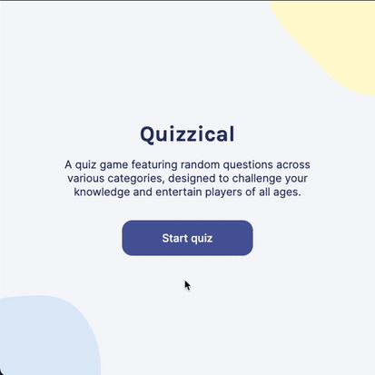
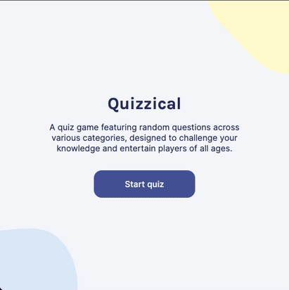

# Quizzical

Quizzical is React-based trivia game that fetches trivia questions from the Open Trivia Database API, providing visual feedback for correct/incorrect answers and calculating the player score.

## Table of contents

- [Overview](#overview)
  - [The challenge](#the-challenge)
  - [Screenshots](#screenshots)
  - [Links](#links)
- [My process](#my-process)
  - [Built with](#built-with)
  - [What I learned](#what-i-learned)
  - [Continued development](#continued-development)
  - [Useful resources](#useful-resources)
- [Author](#author)

## Overview

### The challenge

Users should be able to:

- Click on 'Start Quiz' button to fetch a new set of questions from the [Open Trivia Database API](https://opentdb.com/api_config.php).
- Select a single answer for each trivia question.
- Submit answers and receive visual feedback showing correct and incorrect answers.
- Click on 'Play again' to fetch a new set of trivia questions.
- Navigate using the keyboard (accessibility).

### Screenshots

#### Demos using mouse navigation (left) and keyboard navigation (right)
<div style="display: flex; gap: 2em">
  
  
</div>

### Links
- Live Site URL: [Add live site URL here](https://your-live-site-url.com)

## My process

### Built with

- [Vite](https://vite.dev/) (build tool)
- [React](https://reactjs.org/) - JS library
- CSS custom properties
- Flexbox
- CSS Grid
- Mobile-first workflow

### What I learned

#### React Hooks
- useEffect
- useState

```js
useEffect(() => {
    setIsFetchingTrivia(true);
    // Async function to fetch new trivia questions
    async function getTriviaQuestions() {
      try {
        const response = await fetch('https://opentdb.com/api.php?amount=5');
        const data = await response.json();
        const triviaArray = await data.results.map(triviaObj => {
          return {
            id: nanoid(),
            type: triviaObj.type,
            difficulty: triviaObj.difficulty,
            category: triviaObj.category,
            question: triviaObj.question,
            correctAnswer: triviaObj.correct_answer,
            incorrectAnswers: triviaObj.incorrect_answers,
            shuffledArray: shuffleArray([
              ...triviaObj.incorrect_answers,
              triviaObj.correct_answer,
            ]),
            selectedAnswer: '',
          };
        });

        setTriviaQuestions(triviaArray);
        setQuestionCount(triviaArray.length);
        setIsFetchingTrivia(false);
      } catch (err) {
        console.error(err);
      }
    }

    // Debounce to prevent rate limiting
    const timeoutId = setTimeout(() => {
      getTriviaQuestions();
    }, 1000);

    return () => {
      clearTimeout(timeoutId);
      // Turn off loading animation
      setIsFetchingTrivia(false);
    };
  }, [playCount]);
```

### Continued development
- Allow player to select the number of trivia questions
- 

### Useful resources
- [A Complete Guide to useEffect](https://overreacted.io/a-complete-guide-to-useeffect/) - This helped me understand useEffect more in-depth. 

## Author

- Portfolio - [Jeff Eng](https://www.jeffeng.com)
- X - [@elev8eng](https://www.x.com/elev8eng)